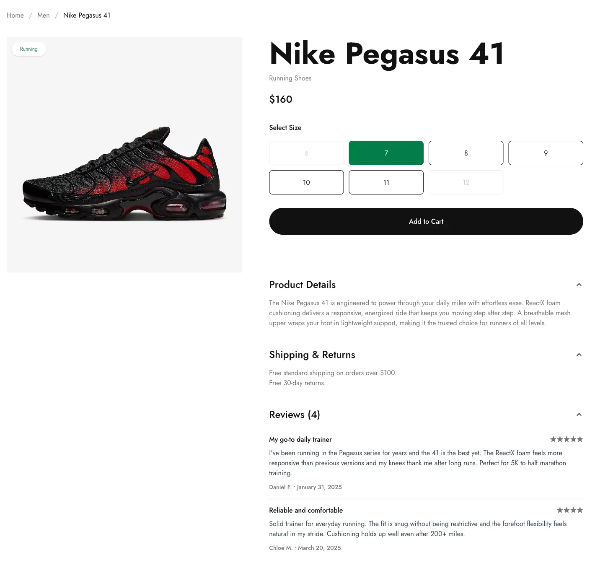
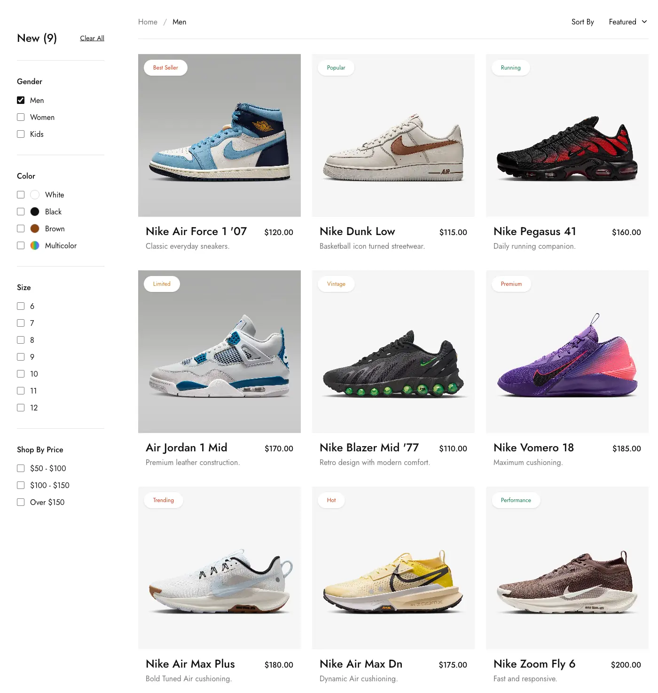
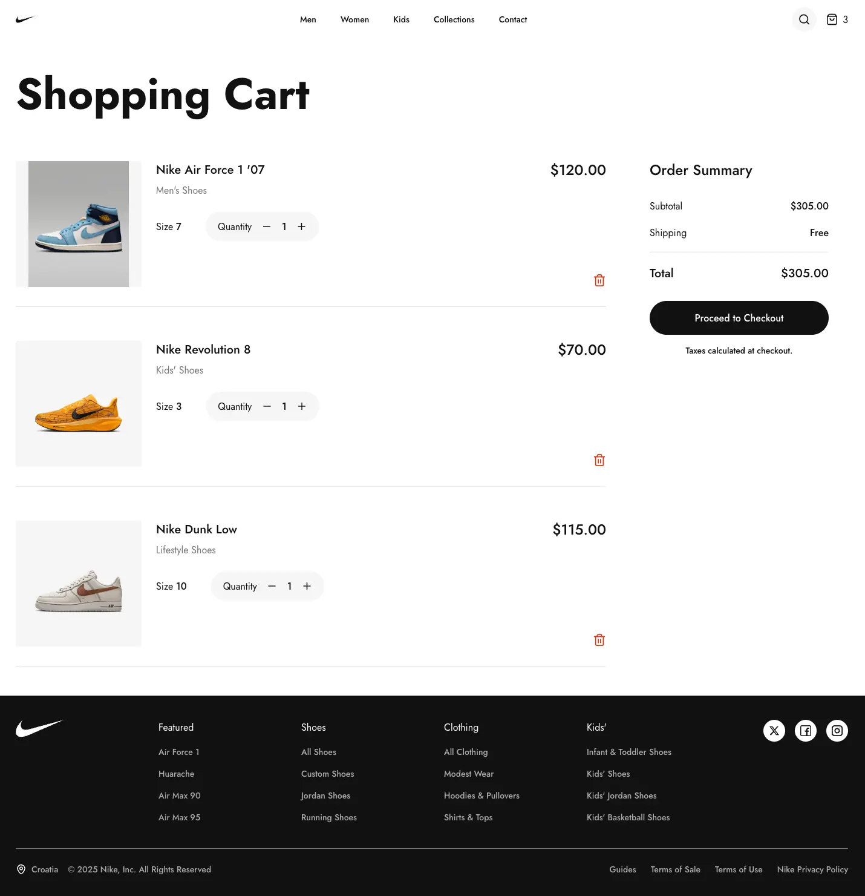
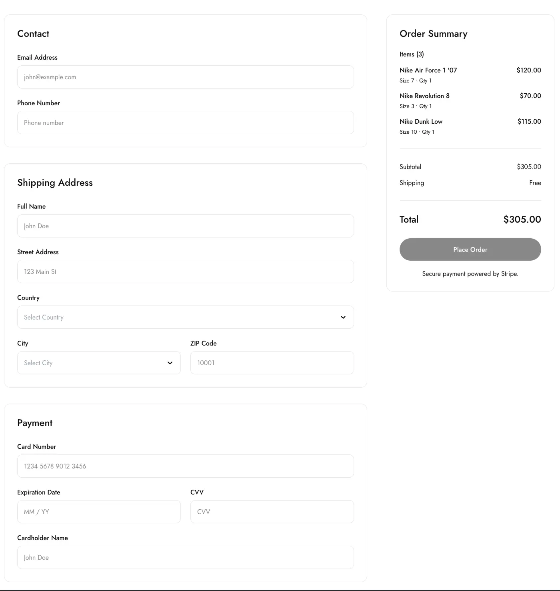
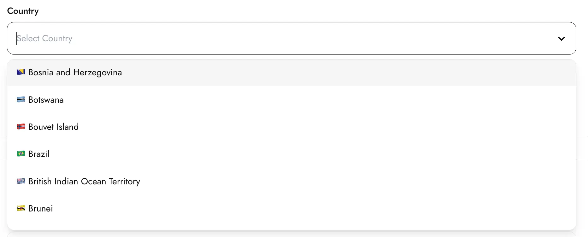
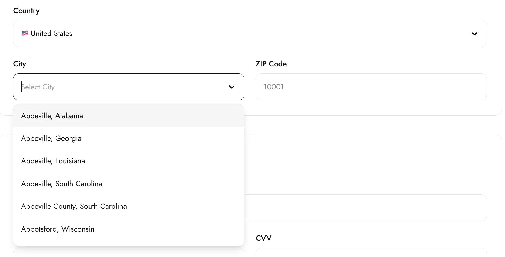
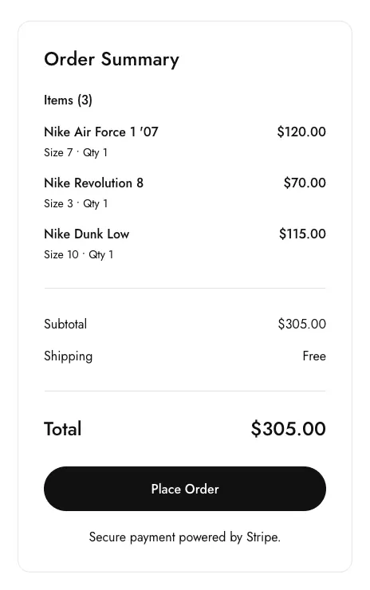

---

# Nike E-commerce

A modern, responsive e-commerce application built with **React** and **TypeScript**. The project simulates a real online shopping experience, including product browsing, filtering, shopping cart management, and a complete checkout flow with form validation.

---

# Tech Stack

* React
* TypeScript
* React Router
* React Hook Form
* React Select
* Context API
* Tailwind CSS
* Lucide React
* country-state-city

---

# Features

## Product Catalog

Implemented a responsive product catalog with dedicated pages for **Men**, **Women**, and **Kids** collections.

Features include:

* Responsive product grid
* Individual product pages
* Product badges
* Product descriptions
* Customer reviews

### Each product page includes:

* Dynamic size selection
* Available and unavailable size states
* Add to Cart functionality
* Success feedback after adding an item
* Product details
* Shipping information
* Customer reviews



---

## Advanced Product Filtering

Built a reusable filtering system that allows users to filter products by:

* Gender
* Color
* Size
* Price Range

Multiple filters can be combined simultaneously.

The size filter automatically adapts based on the selected category:

* Kids → children's sizes only
* Men/Women → adult sizes only

Filtering logic is separated into reusable utility functions for better scalability.

### Product Sorting

Implemented client-side product sorting with multiple options:

* Featured
* Price: Low to High
* Price: High to Low

Sorting is applied after filtering, providing a seamless browsing experience.




---

## Breadcrumb Navigation

Implemented reusable breadcrumb navigation to improve usability and help users understand their current location within the website.

Example:

```text
Home / Men / Nike Air Max 90
```
---

# Shopping Cart

Implemented a fully functional shopping cart using **React Context API**.

Features include:

* Add products
* Remove products
* Update quantities
* Automatic price calculations
* Persistent cart state throughout the application
  


---

# Checkout Flow

Built a multi-section checkout form consisting of:

* Contact Information
* Shipping Address
* Payment Details

The entire checkout process is managed using a single **React Hook Form** instance with **FormProvider** and **useFormContext**.



---

## Form Validation

Implemented comprehensive client-side validation using **React Hook Form**.

Validation includes:

### Contact Information

* Email validation
* International phone number validation

### Shipping Address

* Full Name
* Street Address
* Country selection
* City selection
* ZIP Code

### Payment Information

* Card Number formatting and validation
* Expiration Date validation
* CVV validation
* Cardholder Name validation

Additional features:

* Custom validation utilities
* Reusable custom hooks
* Real-time input formatting
* Inline validation messages
* Submit button remains disabled until the form is valid

---

## Dynamic Country & City Selection

Integrated the **country-state-city** package to provide dynamic country and city data.

Combined with **React Select** to create fully customized searchable dropdowns.

Features:

* Searchable country selector
* Dynamic city list based on the selected country
* React Hook Form integration
* Custom styling

<p align="center">
  
  
</p>
---

## Dynamic Order Summary

Implemented a dynamic order summary that automatically displays:

* Ordered products
* Selected size
* Quantity
* Product totals
* Order subtotal
* Shipping cost
* Free shipping for orders over **$100**
* Final order total

The summary updates instantly whenever the cart changes.

<p align="center">
  
</p>

---

## Accessibility

Improved accessibility by implementing:

* Proper label associations
* htmlFor and id attributes
* Browser autocomplete support
* Keyboard-friendly form controls

---

## Reusable Architecture

The project follows a reusable component architecture.

Reusable UI components include:

* Button
* Sidebar
* Breadcrumbs
* Products Toolbar
* Products Grid
* Accordion
* Country Select
* City Select
* Order Summary

Business logic is also separated into reusable modules:

* Custom Hooks
* Validation Utilities
* Filtering Utilities
* Sorting Utilities
* Context API

---

# Libraries Used

| Library                | Purpose                               |
| ---------------------- | ------------------------------------- |
| **React Hook Form**    | Form management and validation        |
| **React Select**       | Custom searchable dropdown components |
| **country-state-city** | Dynamic country and city data         |
| **React Router**       | Client-side routing                   |
| **Context API**        | Shopping cart state management        |
| **Lucide React**       | Icon library                          |
| **Tailwind CSS**       | Responsive UI styling                 |

---

# Highlights

* Responsive Design
* Reusable Components
* React Context API
* React Hook Form
* Dynamic Filtering
* Dynamic Sorting
* Shopping Cart
* Checkout Flow
* Form Validation
* Custom Hooks
* Utility Functions
* Clean Architecture
* TypeScript

